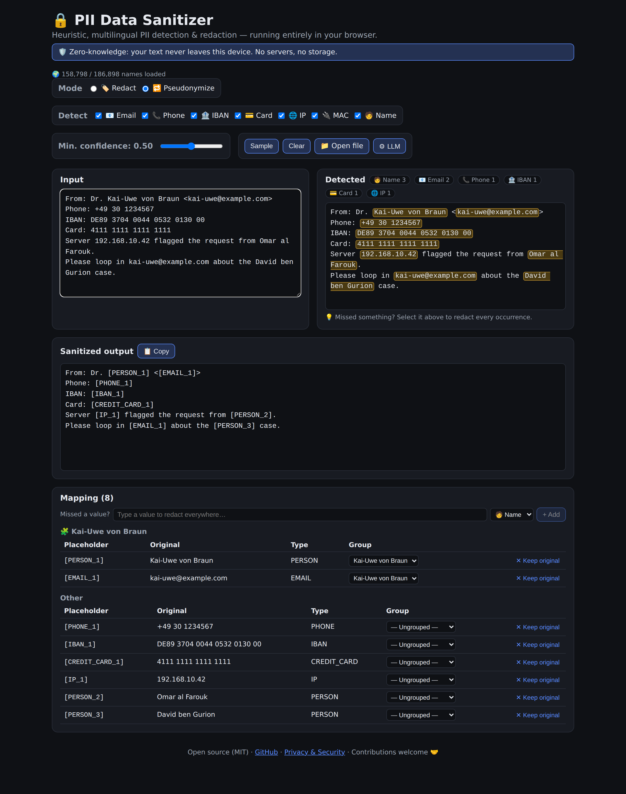

# 🔒 PII Data Sanitizer

> Detect and remove personal data (PII) from text — **entirely in your browser**.
> Zero-knowledge by design: your text never leaves your device. No servers, no
> storage, no tracking.

### ▶︎ [**Try the live demo**](https://pii-data-sanitizer.web.app/) — paste text, watch PII disappear. Nothing is uploaded.

[](https://pii-data-sanitizer.web.app/)
[](https://github.com/t11z/pii-data-sanitizer/actions/workflows/ci.yml)
[](https://github.com/t11z/pii-data-sanitizer/releases)


[](https://pii-data-sanitizer.web.app/)

---

## ✨ Why

Pasting logs, support tickets, or documents into an LLM or a bug tracker often
leaks names, emails, IBANs, and more. This tool strips that out **before** the
text leaves your hands — and because it runs 100% client-side, the sanitizer
itself never sees your data on any server.

## 🛡️ Zero-knowledge

- All detection and replacement happens in the browser (in a Web Worker).
- No backend, no database, no analytics. Firebase is used **only** as a static
  CDN. A strict Content-Security-Policy blocks outbound connections — the only
  exception is an opt-in connection to a **local** Ollama (see below), which
  stays on your own machine.
- The name database ships as compact, read-only assets — nothing is uploaded.
- File inputs are parsed locally too: paste text, or open `.txt`, `.csv`,
  `.json`, `.docx`, and `.pdf` files — PDFs/DOCX are decoded in-browser (bundled
  pdf.js + local unzip), so the file never leaves your device.

## 🧠 How it works

A layered heuristic engine (`src/core`):

1. **Structured PII** — high-precision detectors gated by checksums or context:
   📧 email · 📞 phone · 🏦 IBAN (mod-97) · 💳 credit card (Luhn) · 🌐 IPv4/IPv6 ·
   🔌 MAC · 🪪 national ID (US SSN allocation rules, German tax-ID ISO 7064) ·
   📘 passport and 🎂 date of birth (cue-gated, e.g. after "Passport No" / "DOB").
2. **Names** — a script-aware tokenizer + a multilingual name database
   (Bloom-filter packs) + **context** (titles, nobiliary/patronymic particles,
   capitalization, position) combined into a transparent **confidence score**.
   This catches complex names like `Kai-Uwe von Braun`, `Omar al Farouk`, or
   `David ben Gurion` while guarding against everyday words that happen to be
   names (`frank`, `rose`, `Berlin`).
3. **Resolution & sanitization** — overlaps are resolved by confidence, then
   matches are either 🏷️ **redacted** (`[EMAIL]`) or 🔁 **pseudonymized**
   (stable `[PERSON_1]`, structure-preserving — ideal for LLM input).

For the full pipeline, the scoring model, and the Bloom-pack database, see
[`ARCHITECTURE.md`](ARCHITECTURE.md).

## 📊 Accuracy

Detection is measured per PII type with precision/recall/F1 against a labeled corpus,
behind two CI gates (a locked *proven* suite + an F1 baseline). The methodology, the
honest caveats about what the numbers mean, and a same-corpus comparison against
**Microsoft Presidio** are documented in [`docs/evaluation.md`](docs/evaluation.md) and
[`docs/comparison.md`](docs/comparison.md).

## 🤝 Optional: local LLM second layer (Ollama)

The heuristic engine is the default and works fully offline. As an **optional**
second layer you can point the app at a **local [Ollama](https://ollama.com)**
server — it runs a recall-boost pass that flags extra PII the heuristics miss.
Its findings are merged with the heuristic spans (overlap resolution still
prefers the stronger detector).

It is off by default. **No connection is attempted on page load** — the app only
probes for Ollama once you open the `⚙︎ LLM` panel, so the hosted (HTTPS) site
never triggers the browser's "access local network devices" prompt unprompted.
Inside the panel, the enable toggle + model picker show up only after a
successful probe. We deliberately do **not** offer cloud LLM
providers: that would send your text to a third party and break the "your data,
your sovereignty" promise. If you want a cloud model, you can put it behind your
own Ollama yourself.

Enable it:

```bash
ollama serve              # start the local server (default :11434)
ollama pull llama3.2      # pull any model you like
```

- **Privacy:** your text is sent **only to your own Ollama**, never to us or any
  cloud. Local inference keeps the zero-knowledge story intact.
- **CORS:** Ollama rejects cross-origin browser requests by default. To use the
  layer from a *served* page, start Ollama with the page's origin allowed, e.g.
  `OLLAMA_ORIGINS=http://localhost:5173 ollama serve` (dev) or your hosted
  origin in production. `OLLAMA_ORIGINS=*` works but is permissive.
- **CSP:** the site's Content-Security-Policy allows `connect-src` to
  `http://localhost:11434` / `http://127.0.0.1:11434` so the probe and analysis
  can reach a local Ollama; everything else stays blocked.
- **Reliability:** if Ollama is unreachable mid-session or returns bad output,
  the app falls back cleanly to heuristics only.

## 🌍 Languages (v1)

Latin-script European, plus transliterated **Indian, Arabic, Hebrew, Persian**
and transcribed **Chinese (Pinyin)** and **Japanese (Romaji)** names, plus a
native-script path for Arabic / Hebrew / Devanagari. Native CJK (no word
boundaries) is intentionally out of scope for v1. Coverage grows continuously
via the self-improvement loop. 🗺️

## 🚀 Quickstart

```bash
npm install
npm run build:db   # generate the name packs
npm run dev        # open the printed localhost URL
```

### No Node / npm? Use the prebuilt bundle

Each tagged release ships a fully static bundle on the project's
[GitHub Releases page](https://github.com/t11z/pii-data-sanitizer/releases).
Download `pii-data-sanitizer-<version>.zip`, unpack it, and serve the folder
with any static HTTP server — for example:

```bash
python3 -m http.server 8080
# then open http://localhost:8080
```

See `RUN_LOCALLY.md` inside the bundle for Docker / `npx serve` variants. The
release workflow that produces these bundles is `.github/workflows/release.yml`
(triggered by pushing a `v*` tag or via *Run workflow*).

Other scripts:

```bash
npm test           # unit + edge-case tests (Vitest)
npm run bench      # precision/recall/F1 gate
npm run check      # type-check (svelte-check)
npm run lint       # ESLint
npm run build      # production build into dist/
npm run ingest     # refresh name data from Wikidata (CC0); network, build-time only
```

Name data comes from two committed sources, both permissively licensed: a curated
set of common names (`scripts/build-db/sources.ts`, the Latin **core** tier) and a
bulk sample ingested from **Wikidata (CC0)** (`scripts/build-db/data/`, the **ext**
tier + native scripts). `build:db` merges them into Bloom packs; the browser loads
the core eagerly, native scripts on demand, and the long tail in the background.

### Use the engine as a library

Structured PII (email, IBAN, …) works out of the box. **Name** detection needs a
name source — load Bloom packs with `PackLoader` (browser) or build one from the
source lists (Node/tests). Without a source, no PERSON matches are produced.

```ts
import { sanitize } from './src/core';
import { nameSourceFromSources } from './src/core/db/fromSources'; // tests/Node helper

const { text, mapping } = sanitize('Mail kai-uwe@example.com to Kai-Uwe von Braun.', {
  mode: 'pseudonymize',
  nameSource: nameSourceFromSources(),
});
// text:   "Mail [EMAIL_1] to [PERSON_1]."
// mapping: [{ placeholder: '[EMAIL_1]', original: 'kai-uwe@example.com', type: 'EMAIL' }, …]
```

In the browser the Web Worker loads packs automatically (Latin core eagerly,
native scripts on demand) — see `src/app/worker/sanitizer.worker.ts`.

## 🤖 Self-improving

The name database already covers **~187k names across 5 scripts**
([live snapshot](docs/metrics.md)) — and it grows on its own. A multi-layer loop
runs Claude Code on a schedule, opening PRs that **expand** the dictionary,
**refine** false positives/negatives, and **discover** coverage gaps then ship a
*generalizing* heuristic fix (never a name dump). It is strictly
**additive/corrective**, never touches already-proven detections, and everything is
gated by tests + the benchmark before a human merges.

Merged examples: [#54](https://github.com/t11z/pii-data-sanitizer/pull/54) (IPv6 CIDR),
[#52](https://github.com/t11z/pii-data-sanitizer/pull/52) (ISO 7812 credit-card guard),
[#48](https://github.com/t11z/pii-data-sanitizer/pull/48) (digit-adjacent name guard).
See [`docs/self-improve.md`](docs/self-improve.md) for the full loop and a worked
case study.

## 🤝 Contributing

**Contributions are very welcome!** This project gets better the more names,
languages, and edge cases the community brings.

- 🌍 **Add names / a language** → extend `scripts/build-db/sources.ts` (or add a
  source in `scripts/build-db/build.ts`) using **permissively licensed** data.
- 🐛 **Fix a miss or false positive** → add a case to `bench/corpus.json` and a
  test, then make it green.
- 💡 **New PII type** → add a detector under `src/core/detectors/`.

Please run `npm test && npm run bench && npm run lint` before opening a PR. See
[CONTRIBUTING.md](CONTRIBUTING.md) for details. First-time contributors are
especially welcome — open an issue if you're unsure where to start. 💜

## ☁️ Deploying

Workflows: `deploy.yml` (live deploy on `main`) and `deploy-preview.yml` 
(per-PR preview channels).

Full setup (Firebase project, repo variables/secrets, going live) is in
[`docs/deployment.md`](docs/deployment.md).

## 📦 Releases & changelog

Tagged releases ship a prebuilt static bundle on the
[Releases page](https://github.com/t11z/pii-data-sanitizer/releases). Notable changes per
version are tracked in [`CHANGELOG.md`](CHANGELOG.md).

## 📄 License

[MIT](LICENSE) © Thomas Sprock
